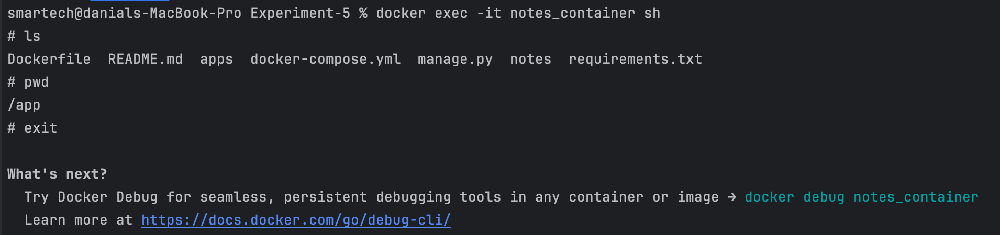

# گزارش آزمایش
## ارسال درخواست به سرور
ابتدا لازم است که دستور 
migration
را اجرا کنیم که  جدول‌ها ساخته شوند.

در ادامه، ابتدا لازم است که کاربر خواسته شده را بسازیم:

همان‌طور که مشاهده کردید این 
API
بدون نیاز به 
session
کار می‌کند و یوزر ما ساخته می‌شود.

حال لازم است که 
login 
کنیم تا
session
برای یوزر ساخته شود:


همانطور که در عکس زیر مشخص است 
cookieهای
کاربر ما تخصیص می‌بایند:


حال، 
noteهای
خود را می‌سازیم:


در نهایت هم لیست 
noteهای
یوزر فعلی که لاگین است را دریافت می‌کنیم:


به همان صورت که مورد انتظار بود لیست را دریافت کردیم.

## تعامل با داکر
### لیست کانتینر‌‌ها
با استفاده از دستور
```bash
docker ps -a
```
می‌توانیم لیست تمام کانتینر‌های موجود در داکر چه فعال 
(up)
و چه غیرفعال
(down)
را بدست آوریم:

همانطور که در عکس مشخص شده صرفا دو تا از کانتینر‌ها مربوط به این آزمایش هستند که در حال حاضر هم فقط همان‌ها 
up
هستند.

### لیست کانتینر‌‌ها
با استفاده از دستور
```bash
docker images
```
می‌توانیم لیست تمام 
imageهای
موجود را ببینیم. البته من در عکس زیر از 
```bash
docker images --filter "reference=[^<]*"  
```
استفاده کردم چرا که تعداد زیادی 
image
با نام 
\<none\>
داشتم و نمی‌خواستم عکس بیهوده شلوغ شود:

همانطور که در این عکس نیز مشخص است صرفا از 
imageهای
notes-app و postgres
استفاده کرده‌ایم.
### اجرای دستور دلخواه در کانتینر وب سرور
با استفاده از دستور
```bash
docker exec -it notes_container sh
```
یک شل در ترمینال ایجاد می‌شود. با استفاده از این شل به راحتی می‌توان هر دستور دلخواهی را اجرا کرد:


<div dir='rtl'>
## پرسش‌ها

### وظایف Dockerfile، image و container
- container:
 یک نرم افزار استاندارد است که پکیج‌هایی قابل اجرا(عموما در غالب کد) و هر آن چه نیاز است تا نرم‌افزار به سرعت و پایدار اجرا شود را در خود گنجانده است.
ویژگی مهم کانتینرها استقلال آنهاست. یک کانتینر عمدتا از محیطی که در آن اجرا می‌شود آگاهی ندارد. این محیط شامل سیستم عاملی که در آن اجرا می‌شود است.
این موضوع باعث می‌شود که به ما در توسعه‌ی نرم‌افزار کمک شایانی در سادگی جدا کردن محیط‌ها بکند.
- Image:
اساس یک کانتینر، تصویر یا image آن است. آنچه که باعث می‌شود یک کانتینر را به کمک docker engine بالا بیاوریم در حقیقت image آن است. این image شامل دستورالعمل‌هایی برای بالا آوردن یک کانتینر است. 
- Dockerfile:
در هر image یک Dockerfile قرار دارد که شامل دستورالعمل‌هایی ست که برای ساختن image به آن نیاز است. بنابراین اگر بخواهیم یک image ایجاد کنیم، نیاز است تا یک Dockerfile برای آن بنویسیم. 
### Kubernetes
کوبرنتیز یک نرم‌افزار مدیریت متمرکز کانتینرها است.
 از کوبرنتیز می‌توان برای اجرای دستورات برای استقرار، اعمال تغییرات، نظارت و تغییر مقیاس برنامه‌ ها متناسب با نیازها استفاده کرد.
استفاده از کوبرنتیز در هر محیط توسعه‌ای به مدیریت محیط‌های مختلف روی زیرساخت یکسان کمک می‌کند.

ارتباط داکر و کوبرنتیز رابطه‌ی مدیریتی است. داکر شامل بسته‌هایی قابل اجرا به نام کانتینر است و هنگامی که تعداد بالایی از این کانتینر‌ها داشته باشیم، نیاز به ابزاری برای مدیریت آنها داریم که این ابزار دقیقا همان کوبرنتیز است.