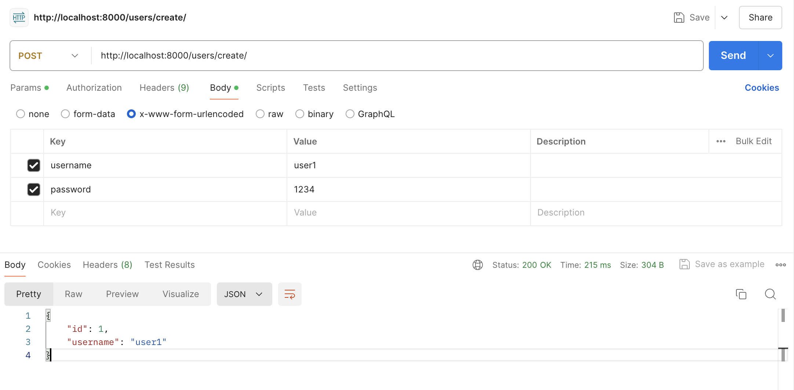

# گزارش آزمایش
## ارسال درخواست به سرور
ابتدا لازم است که دستور 
migration
را اجرا کنیم که  جدول‌ها ساخته شوند.

در ادامه، ابتدا لازم است که کاربر خواسته شده را بسازیم:

همان‌طور که مشاهده کردید این 
API
بدون نیاز به 
session
کار می‌کند و یوزر ما ساخته می‌شود.

حال لازم است که 
login 
کنیم تا
session
برای یوزر ساخته شود:


همانطور که در عکس زیر مشخص است 
cookieهای
کاربر ما تخصیص می‌بایند:


حال، 
noteهای
خود را می‌سازیم:


در نهایت هم لیست 
noteهای
یوزر فعلی که لاگین است را دریافت می‌کنیم:


به همان صورت که مورد انتظار بود لیست را دریافت کردیم.

## تعامل با داکر
### لیست کانتینر‌‌ها
با استفاده از دستور
```bash
docker ps -a
```
می‌توانیم لیست تمام کانتینر‌های موجود در داکر چه فعال 
(up)
و چه غیرفعال
(down)
را بدست آوریم:

همانطور که در عکس مشخص شده صرفا دو تا از کانتینر‌ها مربوط به این آزمایش هستند که در حال حاضر هم فقط همان‌ها 
up
هستند.

### لیست کانتینر‌‌ها
با استفاده از دستور
```bash
docker images
```
می‌توانیم لیست تمام 
imageهای
موجود را ببینیم. البته من در عکس زیر از 
```bash
docker images --filter "reference=[^<]*"  
```
استفاده کردم چرا که تعداد زیادی 
image
با نام 
\<none\>
داشتم و نمی‌خواستم عکس بیهوده شلوغ شود:

همانطور که در این عکس نیز مشخص است صرفا از 
imageهای
notes-app و postgres
استفاده کرده‌ایم.

